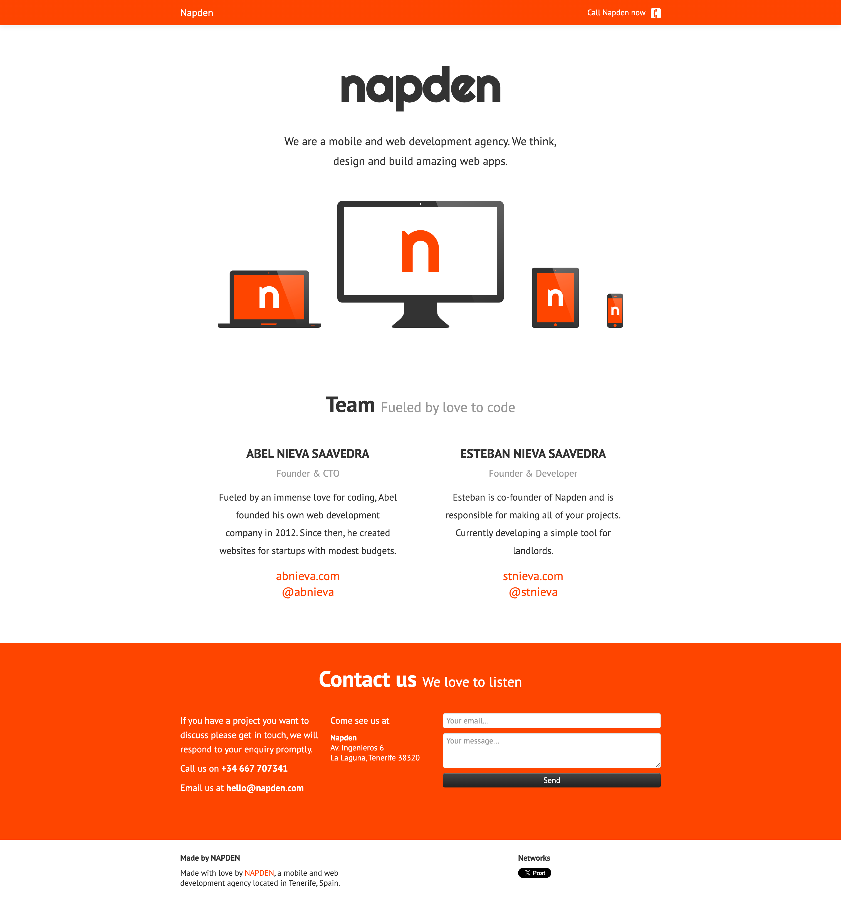

# Napden source code

The Napden website is a simple static site built with Bootstrap.

- Source: [https://github.com/abelnnieva/napden.com](https://github.com/abelnnieva/napden.com)
- Homepage: [http://napden.com](http://napden.com)
- Twitter: [@napden](http://twitter.com/napden)

## Development setup

1. Add your reCAPTCHA public and private keys in `js/main.js` and `/sendmail.php` files.
2. Install sendmail: `sudo apt-get install sendmail`
3. Configure the `/etc/php5/apache2/php.ini` file:
   - `SMTP = smtp.gmail.com`
   - `smtp_port = 465`
   - `sendmail_path = "sendmail -t -i"`
4. Start the PHP Built-in Server: `php -S localhost:8000`
